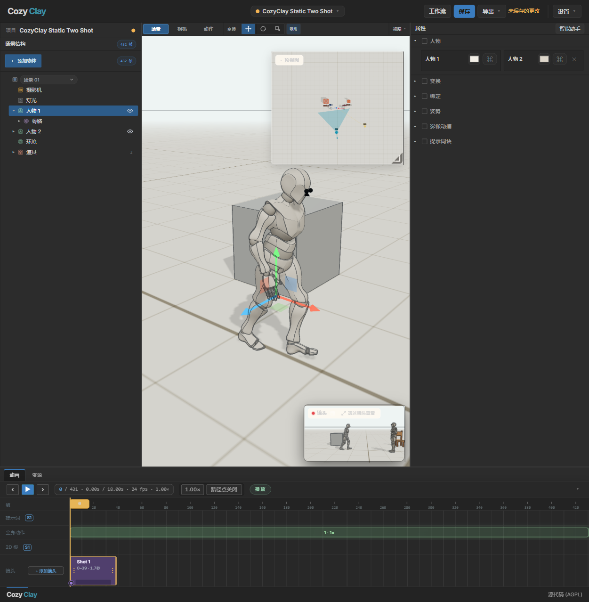

# CozyClay 简体中文分支

这是 [NomaDamas/CozyClay](https://github.com/NomaDamas/CozyClay) 的简体中文界面分支，基于官方 **1.10.0**。原作者及完整功能说明见 [英文 README](README.md)。代码沿用 [AGPL-3.0-or-later](LICENSE)；页面底部的源代码入口指向本分支。

本分支让 Studio 默认显示简体中文，并保留设置菜单里的 English / 한국어 选项。翻译主要覆盖搭场景、人物与姿势、相机、时间轴、工程与导出等日常操作。Workflow 画布、少量高级动作生成提示和项目数据中的原始名称仍可能显示英文；这是当前汉化范围，不影响项目文件格式。



## 运行

需要 Node.js **22.19+**、npm 和 Chromium 系浏览器。此分支尚未发布到 npm；`npx cozyclay` 启动的是官方英文版。

```powershell
git clone https://github.com/acaiaishizhan/CozyClay-zh.git
cd CozyClay-zh
npm ci
npm run build
$env:COZYCLAY_TELEMETRY = '0'
node bin/cozyclay.mjs --no-motion --no-star --no-update-check
```

然后打开 `http://127.0.0.1:5180/app/`。`--no-motion` 只关闭可选的动作生成后端；已有动作、人物路线、相机和导出功能仍可用。可以用 `--port 5182` 与官方版本并排运行。

工程使用官方 `.cclayproject` 格式。请在 Studio 里使用“打开项目…”导入、“另存为…”保存。打开工程时不要覆盖唯一的原文件；浏览器自动保存只适合临时恢复。

## 语言

“设置” → “语言”里可切换简体中文、English、한국어，选择会保存在该浏览器的本地存储中。清除该项后，简体中文仍是默认语言。匿名统计可在同一菜单关闭，也可设置 `COZYCLAY_TELEMETRY=0`。

## 与官方同步

本分支保留上游代码、许可证和版权信息。中文界面改动集中在 `src/`、`app/index.html` 和 `public/manifest.webmanifest`。同步官方更新后需重新构建与复测；不要把本分支当作官方发行包。
